<div align="center">

<p align="center">
  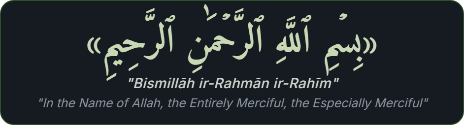
</p>

<p align="center">
  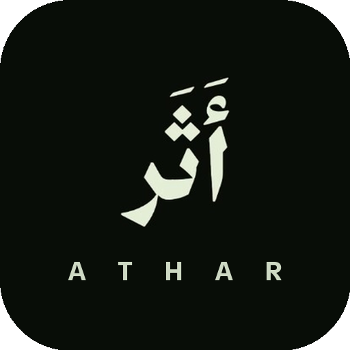
</p>

<p align="center">
  <font size="6"><b>Athar - أثر</b></font>
</p>

<p align="center">
  
</p>

<br>

[](https://github.com/mohammeddtariq/Athar/releases)
[](https://developer.android.com)
[](LICENSE)
[](https://developer.android.com/jetpack/compose)

</div>

---

## Overview

Athar - أثر is an open source Islamic companion created to offer a sanctuary of stillness in modern daily life. Built natively with Jetpack Compose, the application pairs sacred Islamic traditions with an organic, thoughtful design language.

Free from commercial advertisements, tracking algorithms, and noisy interfaces, Athar centers on the timeless essentials of a believer's day.

---

## Core Features

### 🕌 Prayer Horizons
Precise astronomical calculations based on major global conventions. The prayer experience includes flexible juristic options for Asr, dynamic remaining time tracking, and reflective pauses that help center your schedule around your worship.

### 📖 The Quranic Sanctuary
A tranquil space dedicated to the words of the Holy Quran. Designed for continuous reflection, offering comfortable reading modes, customizable typography, and streaming recitations by esteemed reciters.

### 🤲 Daily Remembrance
A curated collection of authentic supplications drawn from Hisnul Muslim. Designed for daily morning, evening, and post-prayer Adhkar, supported by an intuitive digital counter with gentle haptic response.

### 🕋 Sacred Direction
A responsive compass utilizing real-time device sensors to indicate the precise direction and distance to the Kaaba in Makkah, complete with sensor calibration feedback.

### 🔔 Contemplative Reminders
Thoughtful, poetic notification phrases in both Arabic and English tailored for every prayer time. Complemented by a custom-crafted, gentle notification chime designed specifically for the Athar identity.

### 🛡️ Pure and Distraction-Free
Completely offline-capable and free of third-party analytics, account mandates, and advertisements. Your worship remains private, focused, and uninterrupted.

*More features, enhancements, and spiritual tools are continuously on the horizon as Athar grows.*

---

## App Screenshots

<div align="center">

### 1. Home
| Arabic (العربية) | English |
| :---: | :---: |
| 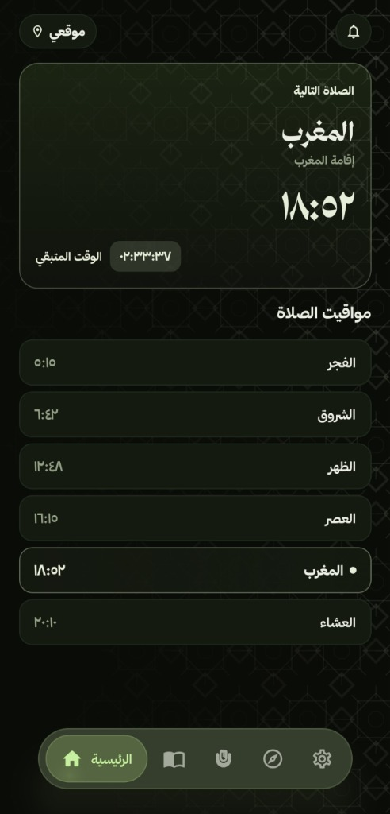 | 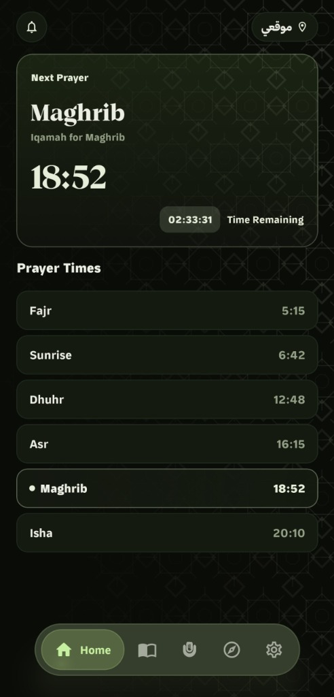 |

<br>

---

### 2. The Holy Quran

| 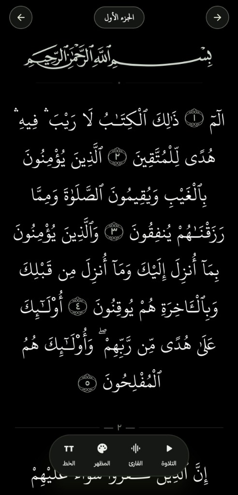 | 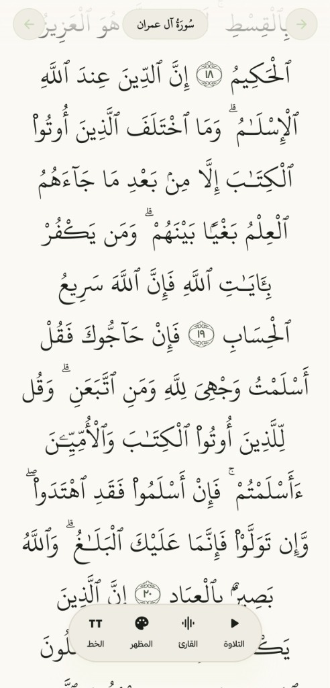 | 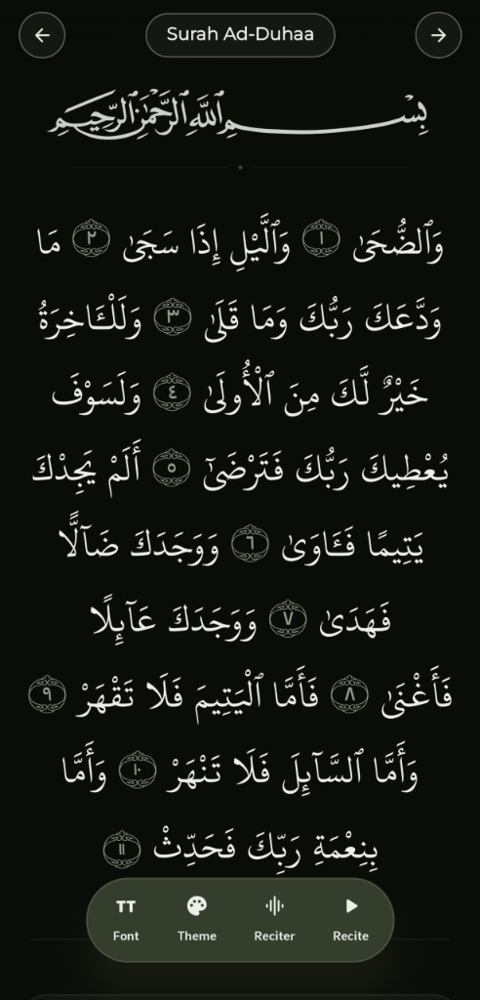 |
| :---: | :---: | :---: |
| **أسود نقي (AMOLED)**<br>AMOLED Dark | **الأبيض الكلاسيكي**<br>Classic Light | **طابع أثر**<br>Athar's Theme |

<br>

---

### 3. Duas
| Arabic (العربية) | English |
| :---: | :---: |
| 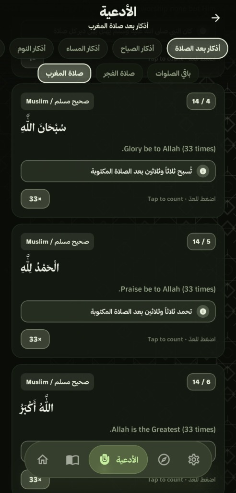 | 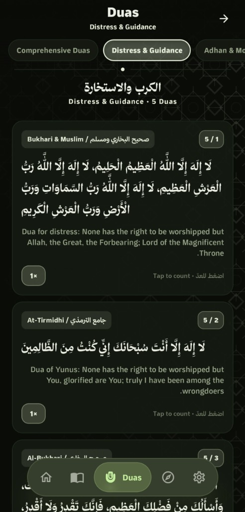 |

<br>

---

### 4. Qibla Direction
| Arabic (العربية) | English |
| :---: | :---: |
| 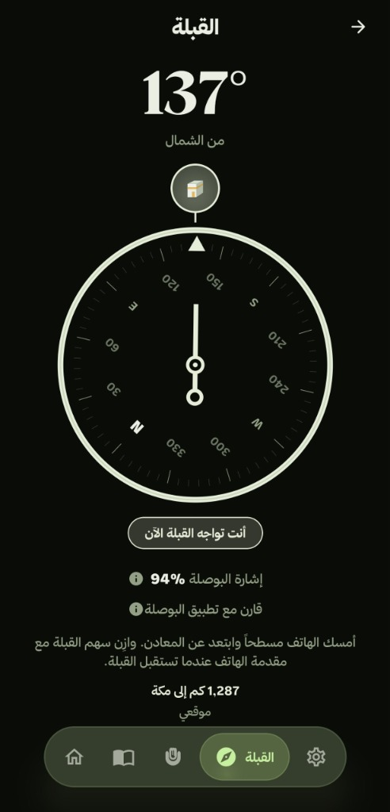 | 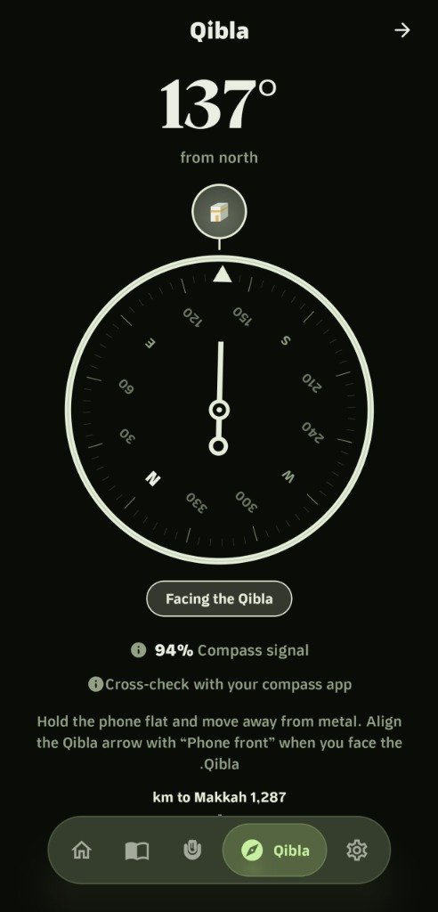 |

</div>

---

## Keep the Project Alive

Athar is currently in its public Beta stage. Community feedback, suggestions, and bug reports are warmly welcomed through [GitHub Issues](https://github.com/mohammeddtariq/Athar/issues) and [Pull Requests](https://github.com/mohammeddtariq/Athar/pulls). Your participation helps refine and sustain this project for the benefit of Muslims everywhere.

<div align="center">

<p align="center">
  
</p>

</div>

---

## Installation & Building

### 1. Download the Release APK
You can download the pre-compiled APK directly from the releases page:
👉 **[Download Latest APK](https://github.com/mohammeddtariq/Athar/releases)**

### 2. Building from Source
Requirements: Android Studio Ladybug (or newer) and JDK 17.

1. Clone the repository:
   ```bash
   git clone https://github.com/mohammeddtariq/Athar.git
   ```
2. Open the project in Android Studio.
3. Synchronize project dependencies with Gradle.
4. Build the application via:
   - Menu: **Build > Build Bundle(s) / APK(s) > Build APK(s)**
   - Or terminal:
     ```bash
     ./gradlew assembleDebug
     ```
5. The generated APK will be located in:
   `app/build/outputs/apk/debug/app-debug.apk`

---

## Acknowledgements & Credits

We express our sincere appreciation to the open source community and public Islamic institutions whose resources enrich this project:

- **[King Fahd Complex for Printing the Holy Quran](https://qurancomplex.gov.sa/)**: Official Uthmanic Hafs typography and sacred text glyphs.
- **[Batoul Apps / Adhan-Java](https://github.com/batoulapps/adhan-java)**: Astronomical prayer times calculation library (Licensed under Apache 2.0).
- **[AndroidSVG](https://bigbadaboom.github.io/androidsvg/)**: Vector graphic rendering engine for Android (Licensed under Apache 2.0).
- **[Tarteel QUL](https://github.com/tarteel-io)**: Contributions toward vector Mushaf layout assets.
- **[Hisnul Muslim](https://hisnmuslim.com/)**: Supplications collection compiled by Sheikh Sa'id bin Ali bin Wahf Al-Qahtani (may Allah have mercy on him).

---

## 📜 License

Athar - أثر is licensed under the [GNU General Public License v3.0](LICENSE), with additional conditions under GPLv3 Section 7:

- **Attribution (7b)**: Any use of this code, including derivative works, must preserve all original notices, disclaimers, and author attributions.
- **Name & Branding Restrictions (7c & 7e)**: Derivative works must use their own distinct branding. The **"Athar"** and **"أَثَر"** names, logos, application icons, and visual trademarks may not be used for the branding or title of derivative works.

See the [LICENSE](LICENSE) file for full GPLv3 terms and the [NOTICE](NOTICE) file for full conditions of GPLv3 Section 7.

---

<div align="center">

<br>

<p align="center">
  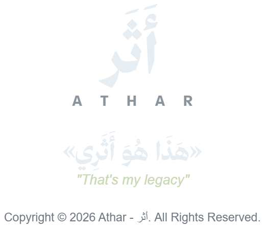
</p>

<br>

</div>
